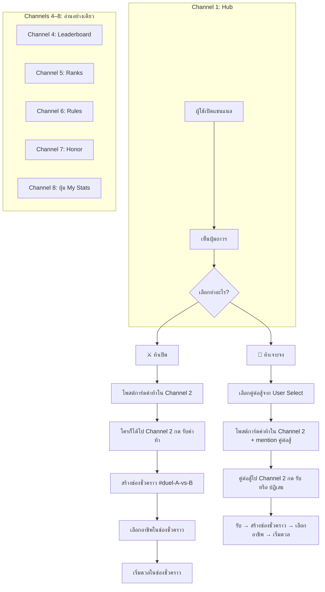
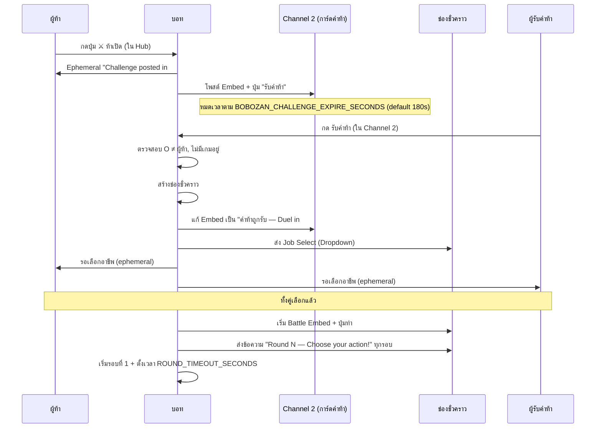
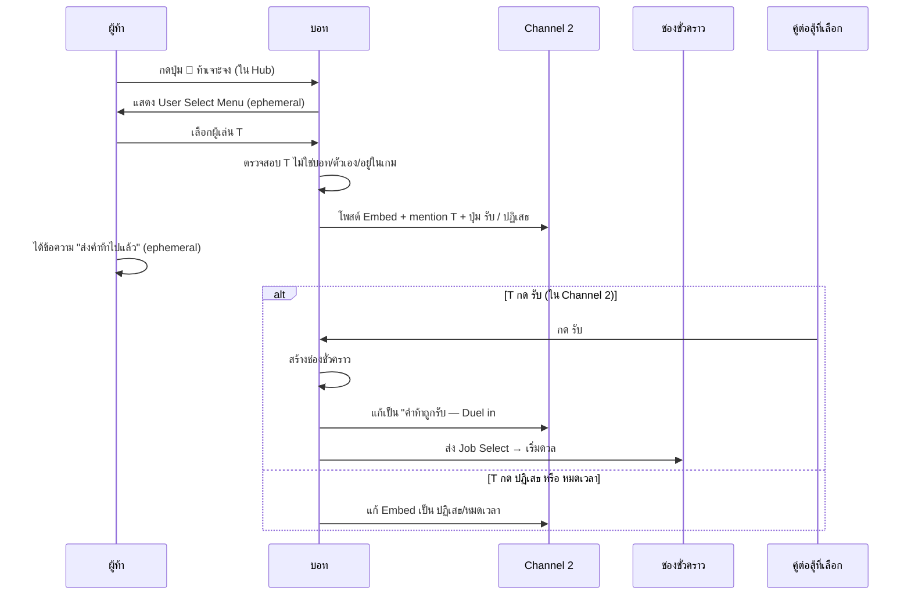
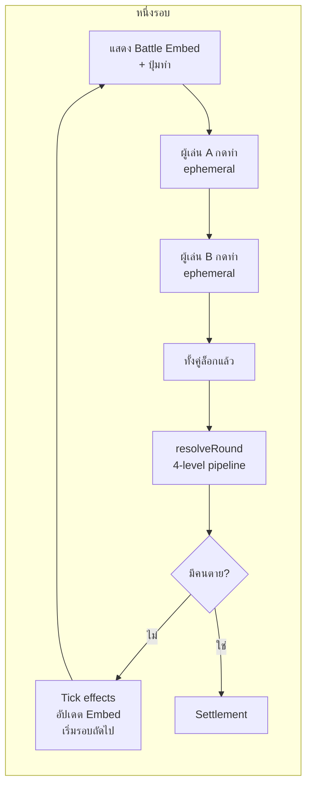
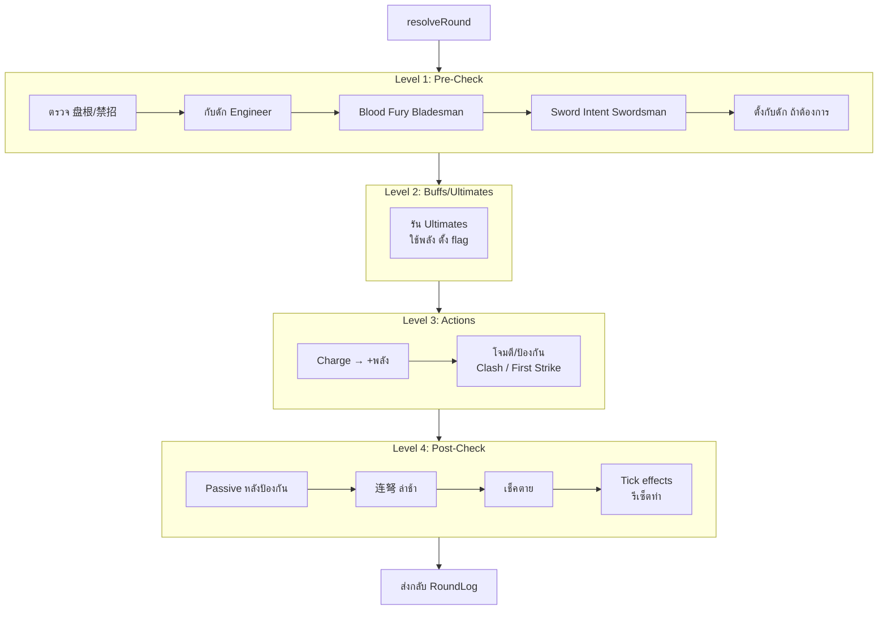
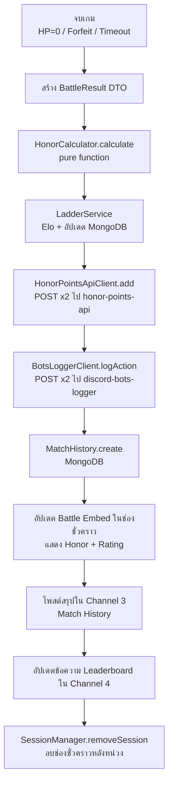
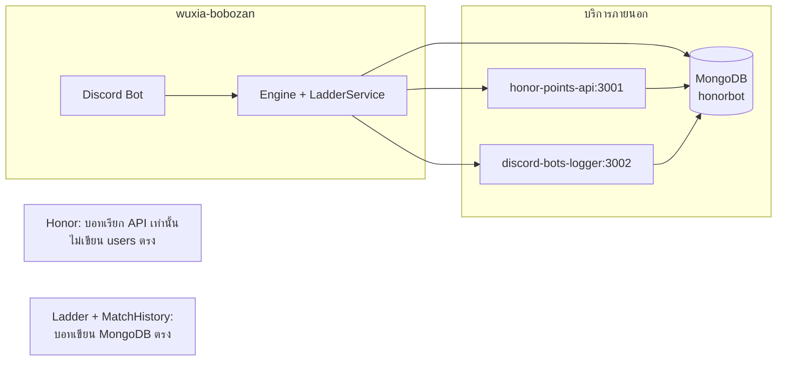

# 武侠波波攒 — Flow การทำงาน

## 1. โฟลว์หลัก (ภาพรวม) — 8 ช่อง + ช่องดวลชั่วคราว

- **Channel 2:** การ์ดคำท้าทั้งแบบเปิดและแบบเจาะจง โพสต์ที่นี่ หมดเวลาตาม `BOBOZAN_CHALLENGE_EXPIRE_SECONDS` (default 180 วินาที)
- **Channel 3:** หลังจบแมตช์ บอตโพสต์สรุป (ใครชนะ/เสมอ กี่รอบ)
- **ช่องชั่วคราว:** เห็นได้เฉพาะผู้เล่น 2 คน + แอดมิน (ถ้ามี) หลังจบแมตช์ลบอัตโนมัติหลังหน่วง `BOBOZAN_TEMP_CHANNEL_DELETE_DELAY_MS`

## 2. ท้าเปิด (Open Challenge)

## 3. ท้าเจาะจง (Targeted Challenge)

---

## 4. รอบดวล (Battle Round)

---

## 5. Combat Resolution (4-Level Pipeline)

---

## 6. Post-Match Settlement

---

## 7. การเชื่อมต่อกับระบบอื่น

---

## 8. Data Flow สรุป

| ขั้นตอน | ข้อมูล | ปลายทาง |
|--------|--------|---------|
| จบเกม | BattleResult | ในหน่วยความจำ |
| คำนวณ Honor | HonorBreakdown A/B | Pure function |
| อัปเดต Ladder | rating, wins, losses, streak, honorTotal | MongoDB `bobozan_ladder_profiles` |
| เพิ่ม Honor กลาง | amount ต่อ user | POST → honor-points-api → MongoDB `users` |
| ส่ง Log | botId, category, action, userId, details | POST → discord-bots-logger → MongoDB `action_logs` |
| บันทึกประวัติ | match metadata | MongoDB `bobozan_match_history` |
